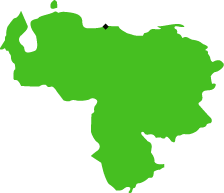

<section class="interactive" id="womenSlider">
  <h2 class="interactive__title">The Legal Status of Prostitution</h2> 
  
  
Prostitution exists on a spectrum when it comes to the law. Drag the slider below to explore the status of prostitution in Venezuela, Colombia, and the United States. 

 

   

     
LEGAL

     
IT DEPENDS

     
ILLEGAL

  

   <input type="range" min="1" max="100" value="10" class="slider" id="myRange">
   

     

       

         
         
VENEZUELA

       

       

        <h3>Regulation</h3>
        
The regulations mentioned only concern prohibiting the prostitution and corruption of minors.

        <h3>Major City</h3>
        
Caracas

        <h3>By the Numbers</h3>
        <ul>
          <li>600,000: the number of women predicted to be trafficked by 2020. Impoverished and indigenous populations are especially vulnerable.</li>
          <li>755: the cost in U.S. dollars a pack of 36 condoms was sold for online. With high costs and shortages of condoms and contraceptives, safe sex is incredibly costly.</li>
        </ul>
       

     

   

 

</section>

