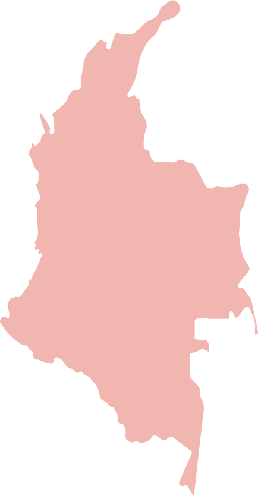

<section class="interactive">
  

        <!-- front page -->
        

          

          

            <h2 class="interactive__title">Birthright Citizenship</h2>
            <h3 class="interactive__subhead">The Legal Limbo of Venezuelans babies born in Colombia</h3>
            
            
Birthright citizenship is the common term to refer to <em>jus soli</em>, meaning “right of the soil," or the right of anyone born in the territory of a state to nationality or citizenship.  
            While the United States grants unconditional citizenship by birth, most countries use a system of “citizenship by blood," meaning that a person born in that country would only be considered as a citizen if one (or both) of their parents has citizenship.

          

        

      

      <!-- slideshow goes here -->
        

          <!-- first slide -->
          

              

          

          <!-- second slide -->
          

              

          

          

            

              
              

                
Colombia has “conditional” birthright citizenship. To obtain Colombian citizenship at birth, one must have at least one parent that is a Colombian citizen or a Colombian legal resident.

                
Unfortunately, many Venezuelan migrants do not fit this description.

              

            

          

          

            

              
              

                
In order for citizenship to be granted to a baby born in Colombia by Venezuelan parents, one of the parents must have either documentation of residency or a special stay permit, known as the PEP.

                
Many Venezuelans have missed the PEP application deadline, and remain in the country under other forms of documentation, but their newborn babies are considered "stateless," as the parents cannot claim Colombian citizenship for their child.

              

            

          

          <!-- slideshow buttons -->
          

            <a class="prev" onclick="plusSlidesBirthright(-1)">&#10094;</a>
            <a class="next" onclick="plusSlidesBirthright(1)">&#10095;</a>
          

        

        

          
          
          
          
        

      <!-- bottom caption -->
      

        Click the arrows or the dots to navigate.
      

    <!-- end of content for passport -->
</section>
