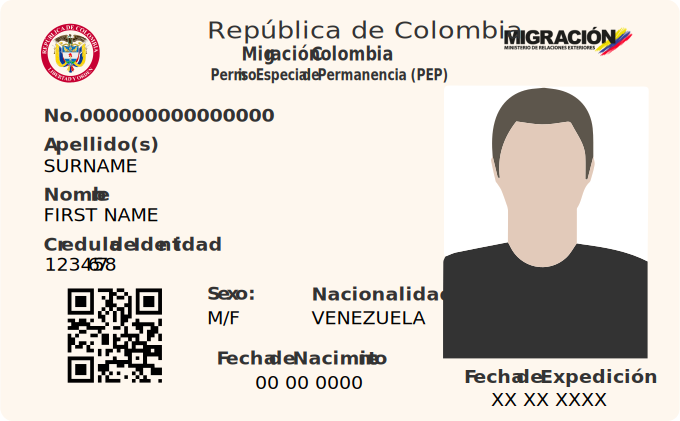
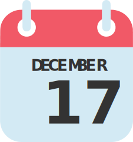
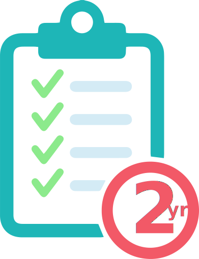
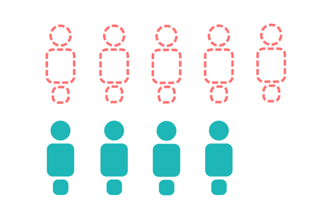

<section class="interactive">
  

    <!-- content for passport-->
    

      
Back

      

        
Passport

      

      <!-- slideshow goes here -->
      

        

          <!-- first slide -->
          

            

              
              

                
The Venezuelan passport comes in navy blue or burgundy. To obtain a passport, citizens must register
                  for an appointment online between 5:30pm to 5am. Usually there are month-long waits for a follow-up
                  after the first appointment. 

                
Appointments are made through the civil registry agency known as SAIME (Servicio Administrativo de
                  Identificación, Migración y Extranjería). 

              

            

          

          <!-- second slide -->
          

            

              
              

                
Obtained through official means, a Venezuelan passport costs about $1.55. While this may not seem like
                  a lot, the current minimum wage hangs around $6. 

                
Some choose to expedite the frustratingly long process and get a passport through the black market with
                  costs upwards of $62.

                
However, as of November 1st, 2018, passports must be paid for in the Petro cryptocurrency. The currency
                  is supposed to be backed by oil and mineral reserves. Passports will cost 2 Petros (about 7,200
                  bolivars) which is equivalent to 4 months salary. 

              

            

          

          

            

              
              

                
A Venezuelan passport is not just travel document but a proof of identity and means of having a say in
                  the government. With over 3 million Venezuelans abroad, 60% of them have irregular status meaning that
                  they can’t vote in elections due to lack of documentation. 

                
For those who have no choice but to leave Venezuela without a passport, they are at risk and struggle
                  to obtain a proof of residence. This limits access to education, healthcare, and ability to join the
                  workforce. 

              

            

          

          

            

              
              

                
Passports are becoming nearly impossible to get due to lack of resources to make the documents,
                  unaffordable prices, and administrative inefficiencies. 

                
With knowledge of this, the Colombian government has decided to help out the Venezuelans within the
                  country’s borders who could not renew their passports back home.

                
Starting in early March of 2019, the Colombian government extended the validity of Venezuelan passports
                  from two years past the expiration date. More than 500,000 Venezuelans could benefit from this decision.
                

              

            

          

          <!-- slideshow buttons -->
          

            <a class="prev" onclick="plusSlidesPassport(-1)">&#10094;</a>
            <a class="next" onclick="plusSlidesPassport(1)">&#10095;</a>
          
      
        

        

          
          
          
          
        

      

      <!-- bottom caption -->
      

        Click the arrows or the dots to navigate.
      

    

    <!-- end of content for passport -->
    <!-- content for pep-->
    

      
Back

      

        
PEP - "Special Stay Permit"
    
      

      <!-- slideshow goes here -->
      

        

          <!-- first slide -->
          

            

              
              

                PEP is short for Permiso Especial de Permanencia, Spanish for Special Permit of Permanence. It is a
                special permit granted to Venezuelans who sought refuge in Colombia.
              

            

          

          <!-- second slide -->
          

            

              
              

                
Venezuelans are eligible to apply for the PEP if they arrived in Colombia through an authorized
                  immigration post before December 17, 2018, and do not have criminal records.

                
Required document: Passport or Identity Card

              

            

          

          

            

              
              

                
The PEP is valid for 90 days and is extendable to a maximum of 2 years. With PEP, Venezuelans are able
                  to work, study, access the health system and perform legal activity within the Colombian territory.

              

            

          

          

            

              
              

                
As of December 2018, <b>1,174,743</b> Venezuelans have migrated to Colombia, and only <b>45.6%</b> have
                  PEP.

                
In other words, more half of the Venezuelans in Colombia are undocumented.

              

            

          

          <!-- slideshow buttons -->
          

            <a class="prev" onclick="plusSlidesPassport(-1)">&#10094;</a>
            <a class="next" onclick="plusSlidesPassport(1)">&#10095;</a>
          

        

        

          
          
          
          
        

      

      <!-- bottom caption -->
      

        Click the arrows or the dots to navigate.
      

    

    <!-- end of content for pep -->
    <!-- contont for National id -->
    

      
Back

      

        
Venezuelan ID Card

      

      <!-- slideshow goes here -->
      

        

          <!-- first slide -->
          

            

              
              

                
A Venezuela ID Card, also known as a Cédula de Identidad, is the national identity card Venezuela’s
                  government issues. Many countries, such as China (PRC Resident Identity Card) and France (Carte
                  Nationale d’Identité), use national identity cards. 

              

            

          

          <!-- second slide -->
          

            

              
              

                
To obtain a cédula, Venezuelans must be at least nine years old and provide an original birth
                  certificate.
                
It’s difficult to go a day without needing a cédula. They are used to make purchases, vote, travel domestically and internationally, and stay in hotels. 

                
Cédulas contain a number that is used to identify every citizen.

              

            

          

          

            

              
              

                
It’s becoming almost impossible to get a cédula due to shortage of resources to make the documents. Most offices do not have the printers needed and some that can print ask citizens to bring their own laminator.

                
Cédulas were once the main documentation Venezuelan migrants used to legally enter surrounding countries, but now many countries, such as Peru, are requiring a passport because cédulas are easy documents to forge and falsify. 

              

            

          

          

            

              
              

                
Starting in December 2016, President Nicolás Maduro rolled a new identity card called the Carnet de la
                  Patria, or “Fatherland Card.” Over half the population has enrolled for the new card.

                
The new ID card has come under criticism as being a way for the government to monitor citizens and
                  allocate scarce resources. The card gives a lot of personal data, such as location or whether someone
                  voted, to computer services.

                
Venezuelan officials learned on a trip in 2008 that Chinese company ZTE was developing a system that
                  would help Beijing track its citizens behaviors. About six years later, ZTE was hired to build the
                  fatherland card database. 

              

            

          

          <!-- slideshow buttons -->
          

            <a class="prev" onclick="plusSlidesPassport(-1)">&#10094;</a>
            <a class="next" onclick="plusSlidesPassport(1)">&#10095;</a>
          

        

        

          
          
          
          
        

      

      <!-- bottom caption -->
      

        Click the arrows or the dots to navigate.
      

    

    <!-- end of content for national ID -->
    <!-- front page -->
    

      

      

        <h2 class="interactive__title">Undocumented</h2>
        <h3 class="interactive__subhead">The Legal Limbo of Venezuelans in Colombia</h3>
        
      

      

        

          

            
          

          

            
Passport

          

        

        

          

            
          

          

            
PEP

          

        

        

          

            
          

          

            
Venezuelan ID

          

        

      

      

        
Click to explore the documentation

      

    

  

</section>
