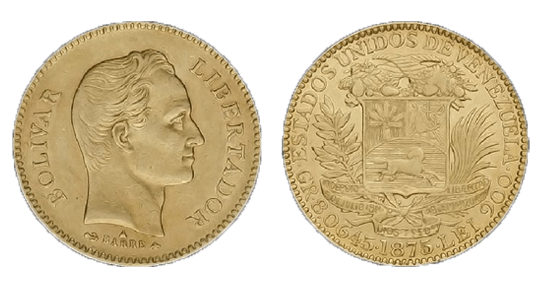

<section class="interactive">
  <h2 class="interactive__title">Venezuelan Bolívar Timeline</h2>
  <h3 class="interactive__subhead">The Bolívar is an ever-changing currency</h3>
 

  

    

      <h2 class="yellow">&nbsp;&nbsp;1879&nbsp;&nbsp;</h2>
      
      Bolívar Coins (Bs.)
    

    

    

      <h3>Bolívar</h3>
      
The Bolívar (Bs.) was a stable currency pegged to silver, gold, and the US dollar.

    

  

  

    

      <h3>Bolívar</h3>
      
Due to economic inflation, coins and bank notes of larger values had to be issued.

    

    

    

      <h2 class="yellow">&nbsp;&nbsp;1998&nbsp;&nbsp;</h2>
      
      Bolívar Bank Notes (Bs.)
    

  

  

    

      <h2 class="blue">&nbsp;&nbsp;2008&nbsp;&nbsp;</h2>
      
      Bolívar Fuerte Coins (BsF.)
    

    

    

        <h3>Bolívar fuerte</h3>
        
The Bolívar fuerte (BsF.) replaced the Bolívar, taking off three zeros from the currency.  Inflation remained even though the numbers were smaller.

    

  

  

    

      <h3>Bolívar fuerte</h3>
      
Economic inlfation strikes again, requiring larger coins and bank notes to be issued.

    

    

    

      <h2 class="blue">&nbsp;&nbsp;2016&nbsp;&nbsp;</h2>
      
      Bolívar Fuerte Bank Notes (BsF.)
    

  

  

    

      <h2 class="red">&nbsp;&nbsp;2018&nbsp;&nbsp;</h2>
      
      Bolívar Soberano Coins (BsS.)
    

    

    

      <h3>Bolívar soberano</h3>
      
The Bolívar soberano (BsS.) replaced the Bolívar fuerte and took five zeros off the currency. 

    

  

  

    

      <h3>Bolívar soberano</h3>
      
The Bolívar soberano is the most recent reissue but due to hyperinflation the currency is virtually worthless.

    

    

    

      <h2 class="red"> &nbsp;&nbsp;2019 &nbsp;&nbsp;</h2>
      
      Bolívar Soberano Bank Notes (BsS.)
    

  

</section>
